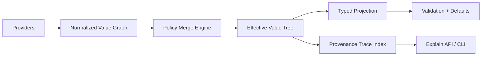

# Bending Figment Architecture for a Logging Library

## Overview

This document explores architectural options for a new logging library that retains Figment's core strengths while reshaping it for logging-specific needs.

**Core Keepers (Figment DNA to retain):**
- Runtime source graph with pluggable providers
- Value-level provenance (every effective value can explain source and merge path)
- Rich merge policies (replace, keep, append, keyed-merge, policy hooks)

---

## Option 1: Policy-Native Figment

Keep provider/value model, but make merge policy first-class and key-path aware.

**Why:** Logging config has heterogeneous semantics (`level` replace, `sinks` append-or-keyed-merge, `filters` ordered pipeline).

**Shape:**
- `config/providers/` source adapters
- `config/merge/` merge planner + conflict policies
- `config/provenance/` explain graph
- `config/schema/` optional typed projection

**Good when:** You want maximum flexibility and plugin friendliness.

**Risk:** Higher engine complexity.

---

## Option 2: Typed Overlay Core

Runtime graph merges raw values, then always projects into a versioned typed model.

**Why:** Prevents "stringly typed drift" while keeping dynamic ingestion.

**Shape:**
- `runtime/` (providers + merge + provenance)
- `model/` (`v1::LoggingConfig`, migrations)
- `validation/` cross-field invariants

**Good when:** Long-term API stability matters.

**Risk:** Migrations and compat work.

---

## Option 3: Dual-Plane Config

Split config into stable core schema and dynamic extension plane.

**Why:** Logging ecosystems often need unknown third-party sinks/processors.

**Shape:**
- `core/` typed (level, outputs, format, sampling)
- `extensions/` dynamic value trees + capability validation

**Good when:** Plugin ecosystem is strategic.

**Risk:** Two validation modes to reason about.

---

## Option 4: Explainability-First Architecture

Make "why is this value this?" a first-class API from day one.

**Why:** Operational debugging of misconfiguration is painful; provenance should be queryable.

**Shape:**
- `provenance/events/` immutable merge events
- `provenance/query/` `explain(path)` API
- `cli/` `explain-config`, `trace-config`

**Good when:** Operations/debugging is top priority.

**Risk:** Memory overhead unless compacted.

---

## Option 5: Contexts Instead of Profiles

Replace Figment-style single selected profile with multi-dimensional context resolution.

**Why:** Modern deployments need more than dev/stage/prod (e.g., `env=prod`, `region=us-east`, `tenant=foo`, `mode=audit`).

**Shape:**
- Context dimensions instead of single profile string
- Resolution by specificity scoring
- Composable context layers

**Good when:** Multi-axis deployment targeting is needed.

**Risk:** Precedence model must be crystal clear.

---

## Architectural Model

---

## Recommended Composite Direction

1. Keep runtime graph + provider trait + provenance tags
2. Upgrade merge from generic to policy-native (path/type aware)
3. Use typed projection boundary for safety/versioning
4. Replace single profile with context dimensions if multi-axis targeting needed
