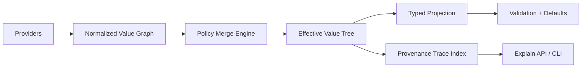

# Bending Figment Architecture for a Logging Library

## Overview

This document explores architectural options for a new logging library that retains Figment's core strengths while reshaping it for logging-specific needs.

**Core Keepers (Figment DNA to retain):**
- Runtime source graph with pluggable providers
- Value-level provenance (every effective value can explain source and merge path)
- Rich merge policies (replace, keep, append, keyed-merge, policy hooks)

---

## Option 1: Policy-Native Figment

Keep provider/value model, but make merge policy first-class and key-path aware.

### Problem Statement

Logging configuration has inherently heterogeneous merge semantics across different fields:

| Field | Desired Semantics | Why |
|-------|-------------------|-----|
| `level` | Replace | Only one effective log level makes sense |
| `sinks` | Append or keyed-merge | Multiple outputs accumulate; may want deduplication by name |
| `filters` | Ordered append | Filter order matters; later filters see already-filtered data |
| `labels` | Deep merge | Merged labels form a combined map |
| `sampling` | Replace | One sampling policy per context |

Figment's current model offers six strategies globally ([`Order` enum](https://github.com/lmmx/figment2/blob/master/src/coalesce.rs#L5-L12)): `Merge`, `Join`, `Adjoin`, `Admerge`, `Zipjoin`, `Zipmerge`. But these apply uniformly at merge time, not per-key-path.

### Key Abstractions

**1. Policy Registry**
```typescript
interface MergePolicy {
  path: string | RegExp;     // e.g., "sinks.*", "level", "labels.**"
  strategy: 'replace' | 'append' | 'deep-merge' | 'keyed-merge' | 'ordered-append';
  keyFn?: (item: Value) => string;  // for keyed-merge
  priority?: number;  // policy precedence when multiple match
}

interface PolicyRegistry {
  register(policy: MergePolicy): void;
  resolve(path: string): MergePolicy;
}
```

**2. Policy-Aware Merge Engine**
```typescript
interface MergeEngine {
  merge(target: ValueTree, source: ValueTree, policies: PolicyRegistry): ValueTree;
  explain(path: string): MergeExplanation;
}

interface MergeExplanation {
  path: string;
  policy: MergePolicy;
  contributors: Array<{ source: Source; value: Value }>;
  winner: { source: Source; value: Value };
}
```

**3. Path-Aware Coalescing**
```typescript
// Extend Figment's Coalescible trait with path context
interface CoalescibleWithPath {
  coalesce(other: this, order: Order, path: Path): this;
}
```

### Directory Structure

```
src/
  config/
    providers/
      index.ts           # Provider trait + built-in adapters
      env.ts             # Environment variable provider
      file.ts            # File-based provider (toml, json, yaml)
      cli.ts             # CLI argument provider
      remote.ts          # Remote config provider (future)

    merge/
      index.ts           # MergeEngine + Order enum
      policies.ts        # PolicyRegistry + MergePolicy types
      coalesce.ts        # Path-aware coalescing logic

    provenance/
      index.ts           # Provenance tracking system
      events.ts          # Merge event log
      explain.ts         # Query API for "why is X = Y?"

    schema/
      index.ts           # Optional typed projection layer
      types.ts           # LoggingConfig, SinkConfig, etc.
```

### API Sketch

```typescript
// Define logging config with per-field policies
const loggingPolicies: MergePolicy[] = [
  { path: 'level', strategy: 'replace' },
  { path: 'sinks', strategy: 'keyed-merge', keyFn: (s) => s.name },
  { path: 'filters', strategy: 'ordered-append' },
  { path: 'labels', strategy: 'deep-merge' },
  { path: '**', strategy: 'replace' },  // default
];

// Build config with policies
const config = Figment.builder()
  .provider(new EnvProvider({ prefix: 'LOG_' }))
  .provider(new FileProvider('logging.toml'))
  .provider(new CliProvider({ flag: '--log-config' }))
  .policies(loggingPolicies)
  .build();

// Extract with full provenance
const effective = config.extract();
const why = config.explain('sinks.file.level');  // "env:LOG_SINKS_FILE_LEVEL overrode file:logging.toml"
```

### Trade-offs

| Aspect | Pro | Con |
|--------|-----|-----|
| Flexibility | Per-field merge semantics match domain needs | More configuration surface |
| Predictability | Explicit policies are auditable | Users must understand policy precedence |
| Provenance | Rich explanations possible | More state to track |
| Complexity | Centralized merge logic | Learning curve for policy DSL |

### References

- Figment's [`Order` enum](https://github.com/lmmx/figment2/blob/master/src/coalesce.rs#L5-L12) - current merge strategies
- Figment's [`Coalescible` trait](https://github.com/lmmx/figment2/blob/master/src/coalesce.rs#L14-L17) - how values combine
- Figment's [`Provider` trait](https://github.com/lmmx/figment2/blob/master/src/provider.rs#L83-L102) - source abstraction

### Good When

- You want maximum flexibility and plugin friendliness
- Different config fields have fundamentally different merge semantics
- Operational debugging requires knowing exactly how values combined

### Risk

- Higher engine complexity
- Policy DSL adds cognitive load
- Must document precedence rules clearly

---

## Option 2: Typed Overlay Core

Runtime graph merges raw values, then always projects into a versioned typed model.

**Why:** Prevents "stringly typed drift" while keeping dynamic ingestion.

**Shape:**
- `runtime/` (providers + merge + provenance)
- `model/` (`v1::LoggingConfig`, migrations)
- `validation/` cross-field invariants

**Good when:** Long-term API stability matters.

**Risk:** Migrations and compat work.

---

## Option 3: Dual-Plane Config

Split config into stable core schema and dynamic extension plane.

**Why:** Logging ecosystems often need unknown third-party sinks/processors.

**Shape:**
- `core/` typed (level, outputs, format, sampling)
- `extensions/` dynamic value trees + capability validation

**Good when:** Plugin ecosystem is strategic.

**Risk:** Two validation modes to reason about.

---

## Option 4: Explainability-First Architecture

Make "why is this value this?" a first-class API from day one.

**Why:** Operational debugging of misconfiguration is painful; provenance should be queryable.

**Shape:**
- `provenance/events/` immutable merge events
- `provenance/query/` `explain(path)` API
- `cli/` `explain-config`, `trace-config`

**Good when:** Operations/debugging is top priority.

**Risk:** Memory overhead unless compacted.

---

## Option 5: Contexts Instead of Profiles

Replace Figment-style single selected profile with multi-dimensional context resolution.

**Why:** Modern deployments need more than dev/stage/prod (e.g., `env=prod`, `region=us-east`, `tenant=foo`, `mode=audit`).

**Shape:**
- Context dimensions instead of single profile string
- Resolution by specificity scoring
- Composable context layers

**Good when:** Multi-axis deployment targeting is needed.

**Risk:** Precedence model must be crystal clear.

---

## Architectural Model



---

## Recommended Composite Direction

1. Keep runtime graph + provider trait + provenance tags
2. Upgrade merge from generic to policy-native (path/type aware)
3. Use typed projection boundary for safety/versioning
4. Replace single profile with context dimensions if multi-axis targeting needed
