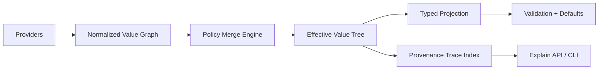

# Bending Figment Architecture for a Logging Library

## Overview

This document explores architectural options for a new logging library that retains Figment's core strengths while reshaping it for logging-specific needs.

**Core Keepers (Figment DNA to retain):**
- Runtime source graph with pluggable providers
- Value-level provenance (every effective value can explain source and merge path)
- Rich merge policies (replace, keep, append, keyed-merge, policy hooks)

---

## Option 1: Policy-Native Figment

Keep provider/value model, but make merge policy first-class and key-path aware.

### Problem Statement

Logging configuration has inherently heterogeneous merge semantics across different fields:

| Field | Desired Semantics | Why |
|-------|-------------------|-----|
| `level` | Replace | Only one effective log level makes sense |
| `sinks` | Append or keyed-merge | Multiple outputs accumulate; may want deduplication by name |
| `filters` | Ordered append | Filter order matters; later filters see already-filtered data |
| `labels` | Deep merge | Merged labels form a combined map |
| `sampling` | Replace | One sampling policy per context |

Figment's current model offers six strategies globally ([`Order` enum](https://github.com/lmmx/figment2/blob/master/src/coalesce.rs#L5-L12)): `Merge`, `Join`, `Adjoin`, `Admerge`, `Zipjoin`, `Zipmerge`. But these apply uniformly at merge time, not per-key-path.

### Key Abstractions

**1. Policy Registry**
```typescript
interface MergePolicy {
  path: string | RegExp;     // e.g., "sinks.*", "level", "labels.**"
  strategy: 'replace' | 'append' | 'deep-merge' | 'keyed-merge' | 'ordered-append';
  keyFn?: (item: Value) => string;  // for keyed-merge
  priority?: number;  // policy precedence when multiple match
}

interface PolicyRegistry {
  register(policy: MergePolicy): void;
  resolve(path: string): MergePolicy;
}
```

**2. Policy-Aware Merge Engine**
```typescript
interface MergeEngine {
  merge(target: ValueTree, source: ValueTree, policies: PolicyRegistry): ValueTree;
  explain(path: string): MergeExplanation;
}

interface MergeExplanation {
  path: string;
  policy: MergePolicy;
  contributors: Array<{ source: Source; value: Value }>;
  winner: { source: Source; value: Value };
}
```

**3. Path-Aware Coalescing**
```typescript
// Extend Figment's Coalescible trait with path context
interface CoalescibleWithPath {
  coalesce(other: this, order: Order, path: Path): this;
}
```

### Directory Structure

```
src/
  config/
    providers/
      index.ts           # Provider trait + built-in adapters
      env.ts             # Environment variable provider
      file.ts            # File-based provider (toml, json, yaml)
      cli.ts             # CLI argument provider
      remote.ts          # Remote config provider (future)

    merge/
      index.ts           # MergeEngine + Order enum
      policies.ts        # PolicyRegistry + MergePolicy types
      coalesce.ts        # Path-aware coalescing logic

    provenance/
      index.ts           # Provenance tracking system
      events.ts          # Merge event log
      explain.ts         # Query API for "why is X = Y?"

    schema/
      index.ts           # Optional typed projection layer
      types.ts           # LoggingConfig, SinkConfig, etc.
```

### API Sketch

```typescript
// Define logging config with per-field policies
const loggingPolicies: MergePolicy[] = [
  { path: 'level', strategy: 'replace' },
  { path: 'sinks', strategy: 'keyed-merge', keyFn: (s) => s.name },
  { path: 'filters', strategy: 'ordered-append' },
  { path: 'labels', strategy: 'deep-merge' },
  { path: '**', strategy: 'replace' },  // default
];

// Build config with policies
const config = Figment.builder()
  .provider(new EnvProvider({ prefix: 'LOG_' }))
  .provider(new FileProvider('logging.toml'))
  .provider(new CliProvider({ flag: '--log-config' }))
  .policies(loggingPolicies)
  .build();

// Extract with full provenance
const effective = config.extract();
const why = config.explain('sinks.file.level');  // "env:LOG_SINKS_FILE_LEVEL overrode file:logging.toml"
```

### Trade-offs

| Aspect | Pro | Con |
|--------|-----|-----|
| Flexibility | Per-field merge semantics match domain needs | More configuration surface |
| Predictability | Explicit policies are auditable | Users must understand policy precedence |
| Provenance | Rich explanations possible | More state to track |
| Complexity | Centralized merge logic | Learning curve for policy DSL |

### References

- Figment's [`Order` enum](https://github.com/lmmx/figment2/blob/master/src/coalesce.rs#L5-L12) - current merge strategies
- Figment's [`Coalescible` trait](https://github.com/lmmx/figment2/blob/master/src/coalesce.rs#L14-L17) - how values combine
- Figment's [`Provider` trait](https://github.com/lmmx/figment2/blob/master/src/provider.rs#L83-L102) - source abstraction

### Good When

- You want maximum flexibility and plugin friendliness
- Different config fields have fundamentally different merge semantics
- Operational debugging requires knowing exactly how values combined

### Risk

- Higher engine complexity
- Policy DSL adds cognitive load
- Must document precedence rules clearly

---

## Option 2: Typed Overlay Core

Runtime graph merges raw values, then always projects into a versioned typed model.

### Problem Statement

Config libraries that stay purely dynamic often suffer from "stringly typed drift":

- Keys are strings, not structured fields
- Typos in config files silently create ignored keys
- Refactoring is unsafe (no compiler help)
- API consumers have no discoverable schema
- Version migrations are ad-hoc and error-prone

A typed overlay solves this by:
1. Letting the runtime engine handle all the messy merging and provenance
2. Projecting the final result into a strictly-typed, versioned model
3. Enforcing a clean boundary between "how we load" and "what we loaded"

### Key Abstractions

**1. Versioned Config Models**
```typescript
// Versioned type namespace
namespace v1 {
  interface LoggingConfig {
    version: '1';
    level: Level;
    sinks: SinkConfig[];
    filters?: FilterConfig[];
    sampling?: SamplingConfig;
    labels?: Record<string, string>;
  }

  interface SinkConfig {
    name: string;
    type: 'file' | 'console' | 'network';
    level?: Level;
    // type-specific fields...
  }
}

// Future version with breaking changes
namespace v2 {
  interface LoggingConfig {
    version: '2';
    // Renamed 'sinks' to 'outputs'
    outputs: OutputConfig[];
    // Added new required field
    defaultLevel: Level;
    // etc.
  }
}
```

**2. Projection Layer**
```typescript
interface ProjectionLayer<T> {
  // Project raw value tree into typed model
  project(tree: ValueTree): Result<T, ProjectionError>;

  // Get schema metadata for docs/validation
  schema(): SchemaMetadata;
}

interface SchemaMetadata {
  version: string;
  fields: FieldMetadata[];
  migrations: MigrationPath[];
}
```

**3. Migration System**
```typescript
interface Migration {
  fromVersion: string;
  toVersion: string;
  migrate(config: unknown): unknown;
}

interface MigrationRegistry {
  register(migration: Migration): void;
  findPath(from: string, to: string): Migration[] | null;
}
```

### Directory Structure

```
src/
  runtime/
    index.ts           # Figment-like runtime engine
    providers/         # Source adapters
    merge/             # Merge policies
    provenance/        # Provenance tracking

  model/
    index.ts           # Re-exports current version
    v1/
      index.ts         # v1::LoggingConfig
      types.ts         # All v1 types
      defaults.ts      # v1 defaults
      projection.ts    # v1 -> typed projection
    v2/
      index.ts         # v2::LoggingConfig (future)
      types.ts
      defaults.ts
      projection.ts

  migrations/
    index.ts           # Migration registry
    v1-to-v2.ts        # Migration from v1 to v2

  validation/
    index.ts           # Cross-field validation
    rules.ts           # Domain-specific rules
```

### API Sketch

```typescript
// Load with automatic version detection and migration
const config = await LoggingLibrary.loadConfig({
  providers: [
    new EnvProvider({ prefix: 'LOG_' }),
    new FileProvider('logging.toml'),
  ],
  targetVersion: '1',  // Request specific version
});

// config is fully typed as v1.LoggingConfig
console.log(config.sinks[0].name);  // TypeScript knows this exists

// Migration happens automatically if source is older version
const legacyConfig = await LoggingLibrary.loadConfig({
  providers: [new FileProvider('old-config.json')],
  // Source is v0, automatically migrated to v1
});

// Schema introspection for tooling
const schema = LoggingLibrary.getSchema('1');
console.log(schema.toMarkdown());  // Generate docs
```

### Validation Examples

```typescript
// Cross-field validation rules
const validationRules: ValidationRule[] = [
  {
    name: 'sink-level-consistency',
    validate: (config) => {
      for (const sink of config.sinks) {
        if (sink.level && isLessSevere(sink.level, config.level)) {
          return { error: `Sink ${sink.name} level ${sink.level} is less severe than global level ${config.level}` };
        }
      }
      return { ok: true };
    }
  },
  {
    name: 'at-least-one-sink',
    validate: (config) => {
      if (config.sinks.length === 0) {
        return { error: 'At least one sink is required' };
      }
      return { ok: true };
    }
  }
];
```

### Version Migration Example

```typescript
// v1-to-v2.ts
const v1ToV2: Migration = {
  fromVersion: '1',
  toVersion: '2',
  migrate: (v1Config: unknown): v2.LoggingConfig => {
    const v1 = v1Config as v1.LoggingConfig;
    return {
      version: '2',
      // Rename 'sinks' -> 'outputs'
      outputs: v1.sinks.map(sink => ({
        id: sink.name,  // rename field
        kind: sink.type,  // rename field
        minLevel: sink.level ?? v1.level,  // required in v2
      })),
      defaultLevel: v1.level,  // renamed field
      filters: v1.filters,
      sampling: v1.sampling,
    };
  }
};
```

### Trade-offs

| Aspect | Pro | Con |
|--------|-----|-----|
| Type Safety | Full compiler support for config structure | Must maintain type definitions |
| Refactoring | Safe with compiler assistance | Migrations require careful planning |
| Documentation | Types are self-documenting | Must keep docs in sync with types |
| Versioning | Explicit migration path | Migration code is additional surface |
| Discoverability | IDE autocomplete works | More upfront design work |

### Good When

- Long-term API stability matters
- Multiple teams consume the config API
- You need to guarantee backwards compatibility
- IDE support and discoverability are important
- Config schema will evolve over time

### Risk

- Migrations and compat work
- Version proliferation over time
- Must plan for deprecation cycles

---

## Option 3: Dual-Plane Config

Split config into stable core schema and dynamic extension plane.

### Problem Statement

Logging ecosystems face a fundamental tension:

- **Core config** (levels, formats, sampling) is stable and benefits from strong typing
- **Extension config** (third-party sinks, custom processors, vendor integrations) is dynamic and unknown at compile time

Forcing everything into one model means either:
- Making everything dynamic (lose type safety)
- Making everything typed (can't support plugins)
- Endless special-case fields (schema bloat)

A dual-plane architecture explicitly separates these concerns.

### Key Abstractions

**1. Core Plane (Typed)**
```typescript
// Stable, versioned, typed config
interface CoreLoggingConfig {
  version: string;
  level: Level;
  format: FormatConfig;
  sampling?: SamplingConfig;
  sinks: CoreSinkConfig[];  // Built-in sink types only
}

type CoreSinkConfig =
  | { type: 'console'; level?: Level; format?: FormatConfig }
  | { type: 'file'; path: string; level?: Level; rotation?: RotationConfig }
  | { type: 'network'; host: string; port: number; level?: Level };
```

**2. Extension Plane (Dynamic)**
```typescript
// Dynamic, plugin-specific config
interface ExtensionConfig {
  plugins: PluginConfig[];
}

interface PluginConfig {
  // Plugin identifier - must be registered
  plugin: string;

  // Capability this plugin provides
  capability: 'sink' | 'filter' | 'formatter' | 'processor';

  // Plugin-specific config (validated by plugin, not core)
  config: Record<string, unknown>;

  // Optional: allow plugin to specify which sinks it attaches to
  attachTo?: string[];
}
```

**3. Plugin Registry**
```typescript
interface Plugin {
  name: string;
  version: string;
  capabilities: Capability[];

  // Plugin validates its own config
  validateConfig(config: unknown): Result<void, PluginError>;

  // Plugin creates its runtime component
  createSink?(config: unknown): Sink;
  createFilter?(config: unknown): Filter;
  createFormatter?(config: unknown): Formatter;
}

interface PluginRegistry {
  register(plugin: Plugin): void;
  get(name: string): Plugin | undefined;
  getByCapability(cap: Capability): Plugin[];
}
```

### Directory Structure

```
src/
  core/
    index.ts           # CoreLoggingConfig + built-in sinks
    types.ts           # Level, Format, Sampling, etc.
    validation.ts      # Core-only validation rules
    defaults.ts        # Core defaults

  extensions/
    index.ts           # ExtensionConfig + PluginRegistry
    types.ts           # PluginConfig, Capability types
    registry.ts        # Plugin registration system
    loader.ts          # Dynamic plugin loading (if applicable)

  builtins/
    sinks/
      console.ts       # Built-in console sink
      file.ts          # Built-in file sink
      network.ts       # Built-in network sink
    filters/
      level.ts         # Built-in level filter
      sample.ts        # Built-in sampling filter

  plugins/
    # Example third-party plugins (not in core)
    elasticsearch.ts   # Elasticsearch sink plugin
    splunk.ts          # Splunk sink plugin
    custom-formatter.ts
```

### API Sketch

```typescript
// Core config is strongly typed
const config = await LoggingLibrary.loadConfig({
  providers: [new FileProvider('logging.toml')],
});

// config.core is fully typed
console.log(config.core.level);  // TypeScript knows this
console.log(config.core.sinks[0].type);  // 'console' | 'file' | 'network'

// Extensions are dynamic but validated by plugins
for (const plugin of config.extensions.plugins) {
  const impl = registry.get(plugin.plugin);
  if (!impl) {
    throw new Error(`Unknown plugin: ${plugin.plugin}`);
  }

  // Plugin validates its own config
  const result = impl.validateConfig(plugin.config);
  if (!result.ok) {
    throw new Error(`Plugin ${plugin.plugin} config invalid: ${result.error}`);
  }

  // Create runtime component
  if (plugin.capability === 'sink') {
    const sink = impl.createSink!(plugin.config);
    logger.addSink(sink);
  }
}
```

### Example Config File

```toml
# Core config (validated by library)
level = "info"
format = { type = "json" }

[[sinks]]
type = "console"
level = "debug"

[[sinks]]
type = "file"
path = "/var/log/app.log"
rotation = { type = "daily", keep = 7 }

# Extension config (validated by plugins)
[[plugins]]
plugin = "elasticsearch-sink"
capability = "sink"
config = { host = "es.example.com", index = "app-logs" }

[[plugins]]
plugin = "pii-filter"
capability = "filter"
config = { patterns = ["ssn", "credit-card"] }
```

### Plugin Implementation Example

```typescript
// elasticsearch-sink plugin
const elasticsearchPlugin: Plugin = {
  name: 'elasticsearch-sink',
  version: '1.0.0',
  capabilities: ['sink'],

  validateConfig: (config: unknown) => {
    const schema = z.object({
      host: z.string(),
      port: z.number().optional().default(9200),
      index: z.string(),
      apiKey: z.string().optional(),
    });

    const result = schema.safeParse(config);
    if (!result.success) {
      return { ok: false, error: result.error.message };
    }
    return { ok: true };
  },

  createSink: (config: unknown) => {
    const { host, port, index, apiKey } = config as ElasticsearchConfig;
    return new ElasticsearchSink({ host, port, index, apiKey });
  },
};

// Register plugin
registry.register(elasticsearchPlugin);
```

### Trade-offs

| Aspect | Pro | Con |
|--------|-----|-----|
| Extensibility | Third parties can add sinks/filters without core changes | Plugin quality varies |
| Type Safety | Core remains fully typed | Extensions are dynamic |
| Complexity | Clear separation of concerns | Two validation paths to understand |
| Distribution | Plugins can be separate packages | Plugin discovery/loading complexity |
| Maintenance | Core stays stable | Plugin API must remain compatible |

### Good When

- Plugin ecosystem is strategic
- Third parties need to add sinks/processors
- Core config should stay stable and small
- You want to support vendor-specific integrations
- Users have custom logging needs beyond builtins

### Risk

- Two validation modes to reason about
- Plugin compatibility across versions
- Plugin discovery/loading complexity
- Need clear plugin API contract

---

## Option 4: Explainability-First Architecture

Make "why is this value this?" a first-class API from day one.

### Problem Statement

Misconfiguration is one of the top sources of production incidents. When logging goes wrong, the questions are always:

- "Why is this sink not receiving logs?"
- "Where did this level come from?"
- "Which config file set this value?"
- "Why is this filter not working?"

Most config libraries give you the final merged value but lose the "why". Figment's tag system provides foundation, but we can make explainability a first-class, queryable API.

### Key Abstractions

**1. Merge Event Log**
```typescript
interface MergeEvent {
  id: string;                    // Unique event ID
  timestamp: number;             // When it happened
  type: 'provide' | 'merge' | 'override' | 'delete';

  path: string;                  // Config path affected
  provider: ProviderInfo;        // Which provider
  profile?: string;              // Which profile

  before?: Value;                // Value before (if any)
  after: Value;                  // Value after
  policy?: MergePolicy;          // Which merge policy applied
}

interface ProviderInfo {
  name: string;                  // e.g., "EnvProvider"
  source: string;                // e.g., "environment", "logging.toml"
  location?: string;             // File:line if available
}
```

**2. Provenance Index**
```typescript
interface ProvenanceIndex {
  // Query the full history of a path
  getHistory(path: string): MergeEvent[];

  // Get the effective value and its source
  getEffective(path: string): EffectiveValue | undefined;

  // Find all values from a specific source
  getByProvider(provider: string): PathValue[];

  // Find all paths that were overridden
  getOverrides(): OverrideInfo[];
}

interface EffectiveValue {
  path: string;
  value: Value;
  source: ProviderInfo;
  event: MergeEvent;           // The winning event
  overriddenBy?: ProviderInfo; // If later overridden
}
```

**3. Explain API**
```typescript
interface ExplainAPI {
  // Human-readable explanation
  explain(path: string): string;

  // Machine-readable explanation
  explainStructured(path: string): Explanation;

  // Full trace for debugging
  trace(path: string): TraceResult;

  // Diff between two configs
  diff(other: Config): DiffResult;
}

interface Explanation {
  path: string;
  effective: Value;
  winner: ProviderInfo;
  candidates: Array<{
    provider: ProviderInfo;
    value: Value;
    whyRejected?: string;
  }>;
  mergePolicy: MergePolicy;
  timeline: MergeEvent[];
}
```

### Directory Structure

```
src/
  provenance/
    index.ts           # Public API exports
    events.ts          # MergeEvent types and event store
    index.ts           # ProvenanceIndex implementation
    query.ts           # Query API for exploring provenance
    explain.ts         # Human/machine explanation generators

  cli/
    explain.ts         # `explain-config` command
    trace.ts           # `trace-config` command
    diff.ts            # `diff-config` command
    print.ts           # `print-effective-config` command
```

### API Sketch

```typescript
// Load config with full provenance tracking
const config = await LoggingLibrary.loadConfig({
  providers: [
    new EnvProvider({ prefix: 'LOG_' }),
    new FileProvider('logging.toml'),
    new FileProvider('logging.override.toml'),
  ],
  trackProvenance: true,  // Enable full tracking
});

// Query: why is level = warn?
const explanation = config.explain('level');
console.log(explanation);
// Output:
// "level = 'warn' (from env:LOG_LEVEL)
//  This overrode 'info' from file:logging.toml
//  Timeline:
//    1. file:logging.toml set level = 'info'
//    2. env:LOG_LEVEL overrode with 'warn' (merge policy: replace)"

// Query: where did sinks.file.path come from?
const trace = config.trace('sinks.file.path');
console.log(trace);
// Output:
// "sinks.file.path = '/var/log/app.log'
//  Source: file:logging.toml:12:3
//  Never overridden"

// Query: what did the env provider contribute?
const envContrib = config.provenance.getByProvider('EnvProvider');
console.log(envContrib);
// Output:
// [
//   { path: 'level', value: 'warn', source: 'env:LOG_LEVEL' },
//   { path: 'sinks.console.level', value: 'debug', source: 'env:LOG_SINKS_CONSOLE_LEVEL' },
// ]

// Query: what values were overridden?
const overrides = config.provenance.getOverrides();
console.log(overrides);
// Output:
// [
//   { path: 'level', from: 'file:logging.toml', to: 'env:LOG_LEVEL' },
// ]
```

### CLI Commands

```bash
# Explain a specific config path
$ logging-lib explain-config level
level = "warn"
  Source: environment variable LOG_LEVEL
  Overrode: "info" from logging.toml

# Trace full resolution for a path
$ logging-lib trace-config sinks.file
sinks.file:
  type: "file"
  path: "/var/log/app.log"     <- logging.toml:12
  level: "info"                <- default (logging.toml set "debug" but was overridden)
  rotation:                    <- logging.toml:14-16
    type: "daily"
    keep: 7

# Print effective config with sources
$ logging-lib print-effective-config --with-sources
# level = "warn"                        # env:LOG_LEVEL
# sinks[0].type = "console"             # logging.toml:5
# sinks[0].level = "debug"              # env:LOG_SINKS_CONSOLE_LEVEL
# sinks[1].type = "file"                # logging.toml:10
# sinks[1].path = "/var/log/app.log"    # logging.toml:12

# Diff two configs
$ logging-lib diff-config logging.toml logging.prod.toml
- level = "info"
+ level = "warn"
- sinks[1].path = "/var/log/app.log"
+ sinks[1].path = "/var/log/app.prod.log"
```

### Memory Considerations

Full provenance tracking can consume significant memory:

```typescript
// Compact representation for production
interface CompactEvent {
  p: string;    // path (interned)
  v: Value;     // value
  s: number;    // source ID (interned)
  t: number;    // event type (enum as number)
}

// Options for controlling memory
interface ProvenanceOptions {
  // Track full history vs. just effective values
  fullHistory: boolean;

  // Keep only last N events per path
  maxHistoryPerPath: number;

  // Intern strings to save memory
  internStrings: boolean;

  // Compact value representation
  compactValues: boolean;
}
```

### Trade-offs

| Aspect | Pro | Con |
|--------|-----|-----|
| Debugging | Can answer "why" questions definitively | More memory/state to track |
| Transparency | Config resolution is fully auditable | More complex implementation |
| Operations | CLI tools for on-call debugging | Must expose carefully to avoid info leaks |
| Performance | Can be tuned with options | Overhead even when minimized |

### Good When

- Operations/debugging is top priority
- Config is complex with multiple sources
- "Why is this value X?" is a common support question
- Compliance requires audit trails
- Multi-team ownership of config sources

### Risk

- Memory overhead unless compacted
- Must be careful what sensitive data appears in provenance
- API surface for querying can become complex
- Performance overhead if not carefully implemented

---

## Option 5: Contexts Instead of Profiles

Replace Figment-style single selected profile with multi-dimensional context resolution.

### Problem Statement

Figment's profile system works well for simple environments (dev/staging/prod), but modern deployments are often multi-dimensional:

| Dimension | Examples |
|-----------|----------|
| Environment | dev, staging, prod, canary |
| Region | us-east-1, eu-west-1, ap-southeast-2 |
| Tenant | acme-corp, big-bank, startup-x |
| Mode | normal, audit, debug, maintenance |
| Feature | enabled, disabled, beta |
| Deployment | blue, green, canary |

A single "profile" string can't capture this richness. You end up with:
- Proliferating profiles: `prod-us-east-audit`, `prod-eu-west-normal`, etc.
- No composable overrides
- Can't say "all prod regions get X, but us-east-1 also gets Y"

### Key Abstractions

**1. Context Dimensions**
```typescript
interface Context {
  dimensions: Map<string, string | string[]>;
}

// Example contexts
const devContext: Context = {
  dimensions: new Map([
    ['environment', 'dev'],
    ['region', 'us-east-1'],
  ]),
};

const prodAuditContext: Context = {
  dimensions: new Map([
    ['environment', 'prod'],
    ['region', 'eu-west-1'],
    ['mode', 'audit'],
    ['tenant', 'acme-corp'],
  ]),
};
```

**2. Context-Aware Config Blocks**
```typescript
interface ContextualConfig {
  // Base config (always applies)
  base: LoggingConfig;

  // Context-specific overlays
  overlays: ConfigOverlay[];
}

interface ConfigOverlay {
  // Which contexts this overlay applies to
  match: ContextMatcher;

  // The config to merge when matched
  config: Partial<LoggingConfig>;

  // Priority when multiple overlays match
  priority: number;
}

interface ContextMatcher {
  // All specified dimensions must match (AND semantics)
  environment?: string | string[];
  region?: string | string[];
  tenant?: string | string[];
  mode?: string | string[];
  // ... arbitrary dimensions
}
```

**3. Specificity Scoring**
```typescript
interface ResolutionEngine {
  // Resolve effective config for a given context
  resolve(context: Context): LoggingConfig;

  // Explain which overlays matched and why
  explainResolution(context: Context): ResolutionExplanation;
}

interface ResolutionExplanation {
  context: Context;
  matchedOverlays: Array<{
    overlay: ConfigOverlay;
    specificity: number;
    contributed: string[];  // Which paths this overlay contributed
  }>;
  effectiveConfig: LoggingConfig;
}
```

### Directory Structure

```
src/
  context/
    index.ts           # Context types and utilities
    dimensions.ts      # Dimension definitions and validation
    matcher.ts         # Context matching logic
    resolution.ts      # Overlay resolution engine

  config/
    base.ts            # Base config definition
    overlays.ts        # ConfigOverlay types and management
    merge.ts           # Context-aware merge logic
```

### API Sketch

```typescript
// Define config with context-aware overlays
const config = ContextualLoggingConfig.builder()
  .base({
    level: 'info',
    sinks: [{ type: 'console' }],
  })
  .overlay({
    match: { environment: 'prod' },
    config: {
      level: 'warn',
      sinks: [
        { type: 'file', path: '/var/log/app.log' },
      ],
    },
  })
  .overlay({
    match: { environment: 'prod', region: 'eu-west-1' },
    config: {
      // GDPR: don't log PII in EU
      filters: [{ type: 'pii-redaction' }],
    },
  })
  .overlay({
    match: { mode: 'audit' },
    config: {
      level: 'debug',
      sinks: [
        { type: 'file', path: '/var/log/audit.log' },
      ],
    },
  })
  .overlay({
    match: { environment: 'prod', mode: 'audit' },
    config: {
      // Audit in prod gets extra logging
      sampling: { enabled: false },
    },
    priority: 100,  // Higher priority than mode: audit alone
  })
  .build();

// Resolve for a specific context
const euProdAudit = config.resolve({
  dimensions: new Map([
    ['environment', 'prod'],
    ['region', 'eu-west-1'],
    ['mode', 'audit'],
  ]),
});

// Result:
// - level = 'debug' (from mode:audit overlay, higher specificity than prod)
// - sinks = [file:/var/log/app.log, file:/var/log/audit.log] (merged)
// - filters = [pii-redaction] (from prod+eu-west-1 overlay)
// - sampling.enabled = false (from prod+audit overlay, priority 100)
```

### Config File Example

```toml
# Base config
level = "info"
[[sinks]]
type = "console"

# Overlay: production
[overlays.prod]
match = { environment = "prod" }
level = "warn"
[[overlays.prod.sinks]]
type = "file"
path = "/var/log/app.log"

# Overlay: EU region (GDPR compliance)
[overlays.eu-gdpr]
match = { environment = "prod", region = ["eu-west-1", "eu-central-1"] }
[[overlays.eu-gdpr.filters]]
type = "pii-redaction"

# Overlay: audit mode
[overlays.audit]
match = { mode = "audit" }
level = "debug"
[[overlays.audit.sinks]]
type = "file"
path = "/var/log/audit.log"

# Overlay: production audit (highest priority)
[overlays.prod-audit]
match = { environment = "prod", mode = "audit" }
priority = 100
sampling = { enabled = false }
```

### Specificity Algorithm

```typescript
function calculateSpecificity(matcher: ContextMatcher, context: Context): number {
  let score = 0;

  for (const [dimension, value] of Object.entries(matcher)) {
    const contextValue = context.dimensions.get(dimension);

    // No match if dimension not in context
    if (contextValue === undefined) return -1;

    // No match if values don't match
    if (!matches(value, contextValue)) return -1;

    // More specific = higher score
    // - Single value: 10 points
    // - Array of values: 5 points (less specific)
    score += Array.isArray(value) ? 5 : 10;
  }

  return score;
}

// Resolution: collect all matching overlays, sort by specificity, merge
function resolve(config: ContextualConfig, context: Context): LoggingConfig {
  const matched = config.overlays
    .map(o => ({ overlay: o, specificity: calculateSpecificity(o.match, context) }))
    .filter(m => m.specificity >= 0)
    .sort((a, b) => {
      // Higher specificity first
      if (a.specificity !== b.specificity) {
        return b.specificity - a.specificity;
      }
      // Then by explicit priority
      return (b.overlay.priority ?? 0) - (a.overlay.priority ?? 0);
    });

  // Merge in order: base, then overlays from least to most specific
  let result = config.base;
  for (const { overlay } of matched.reverse()) {
    result = merge(result, overlay.config);
  }

  return result;
}
```

### Trade-offs

| Aspect | Pro | Con |
|--------|-----|-----|
| Flexibility | Multi-dimensional targeting | More complex mental model |
| Composability | Overlays compose naturally | Debugging resolution can be tricky |
| Maintenance | Add new dimensions without code changes | Must document precedence clearly |
| Testability | Can test each overlay independently | Explosion of context combinations to test |
| Power | Express complex deployment scenarios | Easy to create confusing configs |

### Good When

- Multi-axis deployment targeting is needed
- You have multiple independent dimensions (env, region, tenant, mode)
- Overlays should compose rather than proliferate profiles
- Config needs to express "all X that are also Y" logic
- Different teams own different dimensions

### Risk

- Precedence model must be crystal clear
- Resolution can be hard to debug without tooling
- Easy to create conflicting overlays
- Documentation burden is higher

---

## Architectural Model



---

## Recommended Composite Direction

1. Keep runtime graph + provider trait + provenance tags
2. Upgrade merge from generic to policy-native (path/type aware)
3. Use typed projection boundary for safety/versioning
4. Replace single profile with context dimensions if multi-axis targeting needed
